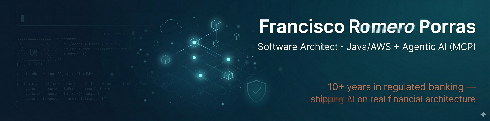

  

<h1 align="center">Francisco Romero Porras</h1>

<h3 align="center">Software Architect · Java/Spring + AWS + Agentic AI (MCP) · Regulated Banking</h3>

  
  
  
  

> **Software Architect & AI Engineer specializing in regulated environments.** Over the past 12+ years, I have designed, scaled, and secured mission-critical JVM/AWS microservices in digital banking, fintech, and blockchain. Today, I lead the integration of Generative AI, Claude Code, and the Model Context Protocol (MCP) into the production software development lifecycle (SDLC) at Openbank (Santander Group). I build the distributed architecture that takes AI to production safely.
>
> 🔗 LinkedIn: <https://www.linkedin.com/in/francisco-romero-porras/>

---

## 🏛️ About me

- **Senior Software Designer (Sr Lvl 2) at Globant** (top technical tier) and **Subject Matter Expert (SME) at Openbank** (Santander Group's 100% digital bank).
- Technical lead and architect for a suite of ~32 microservices running on **Java 21, Spring Boot, and AWS**. I oversee architecture across the **Security & Customer Services, Wealth Management, and Crypto** domains, serving **6 global markets** (Germany, Spain, US, Mexico, Colombia, and the UK).
- A consistent career path focused on high-integrity distributed systems: **Core Banking & APIs ➔ Institutional Blockchain & Tokenization ➔ Agentic AI Systems**. These systems share the same engineering challenges: distributed consensus, secure transactionality, auditability, and a zero-tolerance policy for error.
- **Anthropic-certified** in Model Context Protocol (Advanced Topics), Claude API, and Agentic Architectures. **University Expert in Blockchain Application Development** (UNIR, GPA 9.12) and currently completing a **Master's in AI Development** (BIG School + Universidad Isabel I).

### What I focus on today
- 📐 **High-Integrity Architectures:** Design and scale Java/Spring microservices on AWS under strict European regulatory frameworks (DORA, NIS2, EU AI Act, PSD2).
- 🔐 **Serverless Cryptography:** Build secure serverless encryption and key management pipelines (AWS Lambda + KMS) for sensitive data ingestion, applying Domain-Driven Design (DDD), Hexagonal Architecture, and CQRS.
- 🤖 **Agentic SDLC Adoption:** Integrate Claude Code, custom MCP servers, and multi-agent workflows into the engineering pipeline under deterministic guardrails (pre-commit hooks, strict sandboxing, API policies).
- 🧪 **Engineering Quality:** Run a comprehensive testing pyramid (TDD/BDD via JUnit 5, Mockito, Testcontainers, WireMock) and design distributed tracing/observability architectures (OpenTelemetry, CloudWatch, ELK).
- 🧭 **Technical Leadership:** Act as Chapter Mentor and Tech Lead at Globant, promoting modern DevSecOps standards (GitHub Actions, Infrastructure as Code, OAuth 2.0/JWT, Kubernetes on EKS).

---

## 🧭 Engineering Principles

- **Architecture first, frameworks second:** I evaluate tools like Spring AI, native MCP servers, or LangChain4j strictly on transport efficiency, performance, and architecture fit—never on industry hype.
- **MCP as the enterprise data gateway:** I implement the Model Context Protocol (MCP) as a secure, decoupled interface layer. Decoupling host, client, and servers with JSON-RPC contracts and granular permissions ensures that LLM agents access company data securely.
- **AI-augmented engineering:** I use AI agents to accelerate code analysis, unit test generation, and refactoring. However, all outputs must pass through automated quality gates, human code reviews, and strict compliance pipelines before hitting production.

---

## 💼 Experience

| Role | Company | Client / Domain | Period |
|---|---|---|---|
| Software Designer (Sr Lvl 2) · SME | **Globant** | Openbank (Santander Group) | May 2025 – Present |
| Senior Development Consultant / Tech Lead | **Capitole** | Global fashion retailer (Inditex) | Jun 2023 – Apr 2025 |
| Software Engineer | **iobuilders** | Financial blockchain (BME, BBVA, Allfunds) | Feb 2022 – Jun 2023 |
| Software Crafter | **BBVA Next Technologies** | BBVA Group (Alpha, FilesChannel) | Nov 2020 – Feb 2022 |
| Software Developer | **atSistemas** | El Corte Inglés | Sep 2020 – Nov 2020 |
| Analyst / Developer | **atmira** | FMBBVA, BNP Paribas | Sep 2017 – Sep 2020 |
| Analyst Programmer | **CONNECTIS Iberia** | Aena (airport applications) | Aug 2016 – Sep 2017 |
| Programmer | **Vector ITC** | Banco Santander/ISBAN, Agroseguro | Dec 2014 – Jun 2016 |
| Programmer (earlier roles) | Voiping, CAPTATIVE, RED5, ICONOS | Telefónica, BOSCH, e-learning | 2009 – 2012 |

> *Earlier roles (2009–2020) also covered Azure, Jenkins, Oracle DB, Cucumber, legacy on-prem deployments and waterfall-to-agile transformations — kept here for backwards-compatible context only.*

---

## 🛠️ Tech stack

**Languages**

**Frameworks**

**Cloud & DevOps**

**Messaging & data**

**AI / GenAI**

**Blockchain**

**AWS services (hands-on)**

**Testing & quality**

**Security & regulation**

   

**Observability**

**Architecture:** DDD · Hexagonal Architecture · CQRS · Event-Driven · Microservices · SOLID · Clean Code

**Delivery practices:** TDD/BDD · Spec-Driven Development · AI-Augmented Engineering · DevSecOps · Continuous Delivery

---

## 🎓 Education

| Degree | Institution | Detail | Certificate |
|---|---|---|---|
| **[AI Development Master's](https://thebigschool.com/master-desarrollo-con-ia)** | BIG school + Universidad Isabel I | Double degree · ~60 subjects across 10 modules · *In progress (2026)* | — |
| **[University Expert in Blockchain Application Development](https://www.unir.net/revista/ingenieria/desarrollador-blockchain/)** | UNIR · accredited by CCII & Alastria Consortium | Grade **9.12** · ECC secp256k1, Bitcoin/UTXO, EVM, Solidity, OpenZeppelin, ERC-20/721/725, RGPD on/off-chain | [PDF](<certifications/unir-universidad-internacional-de-la-rioja/UNIR-Experto Universitario en Desarrollo de Aplicaciones Blockchain.pdf>) |
| **Higher VET — Computer Application Development (DAI)** | IES Trassierra | 2010-2012 | [PDF](<certifications/iestrassierra/FP Superior.pdf>) |
| **Intermediate VET — Computer Systems Operation** | IES Medina Azahara | 2007-2009 | [PDF](<certifications/iesmedinaazahara/FP Medio.pdf>) |

---

## 📜 Certifications

> **Credential Archive:** Organized to highlight specialization areas. GenAI & Model Context Protocol (MCP) implementations are listed first, followed by Cloud Architecture & Backend Engineering, and concluding with Technical Leadership and complementary development tracks. Every credential links to its corresponding PDF in this repository's [`certifications/`](certifications/) folder and includes official verification links where available.

### Anthropic — Agentic AI, MCP & Claude

| Certification | Certificate |
|---|---|
| MCP – Model Context Protocol – Advanced Topics | [📄 PDF](<certifications/anthropic/10-model-context-protocol-advanced-topics/certificate-asjzta975tmz-1778491104.pdf>) · [🔗 Verify](https://verify.skilljar.com/c/asjzta975tmz) |
| Building with the Claude API | [📄 PDF](<certifications/anthropic/06-claude-with-the-anthropic-api/certificate-6or6r3ahig4y-1778055913.pdf>) · [🔗 Verify](https://verify.skilljar.com/c/6or6r3ahig4y) |
| Introduction to Model Context Protocol | [📄 PDF](<certifications/anthropic/07-introduction-to-model-context-protocol/certificate-xrdwy3htzkrk-1778056343.pdf>) · [🔗 Verify](https://verify.skilljar.com/c/xrdwy3htzkrk) |
| Claude Code in Action | [📄 PDF](<certifications/anthropic/04-claude-code-in-action/certificate-ef7dnadfuacx-1777985415.pdf>) · [🔗 Verify](https://verify.skilljar.com/c/ef7dnadfuacx) |
| Introduction to Subagents | [📄 PDF](<certifications/anthropic/16-introduction-to-subagents/certificate-mw52ah77vwbu-1778661812.pdf>) · [🔗 Verify](https://verify.skilljar.com/c/mw52ah77vwbu) |
| Introduction to Agent Skills | [📄 PDF](<certifications/anthropic/15-introduction-to-agent-skills/certificate-ucooqb9qmdam-1778661707.pdf>) · [🔗 Verify](https://verify.skilljar.com/c/ucooqb9qmdam) |
| Claude with Amazon Bedrock | [📄 PDF](<certifications/anthropic/11-claude-in-amazon-bedrock/certificate-74pwtb4uitk9-1778499905.pdf>) · [🔗 Verify](https://verify.skilljar.com/c/74pwtb4uitk9) |
| Claude with Google Cloud's Vertex AI | [📄 PDF](<certifications/anthropic/12-claude-with-google-vertex/certificate-8vfgbnnyrzn2-1779181230.pdf>) · [🔗 Verify](https://verify.skilljar.com/c/8vfgbnnyrzn2) |
| AI Capabilities and Limitations | [📄 PDF](<certifications/anthropic/17-ai-capabilities-and-limitations/certificate-wtbhxt8q9yir-1778662348.pdf>) · [🔗 Verify](https://verify.skilljar.com/c/wtbhxt8q9yir) |
| AI Fluency: Framework & Foundations | [📄 PDF](<certifications/anthropic/05-ai-fluency-framework-foundations/certificate-gpmuswtkuo94-1777986045.pdf>) · [🔗 Verify](https://verify.skilljar.com/c/gpmuswtkuo94) |
| Introduction to Claude Cowork | [📄 PDF](<certifications/anthropic/03-introduction-to-claude-cowork/certificate-jkthi469mmtn-1777964695.pdf>) · [🔗 Verify](https://verify.skilljar.com/c/jkthi469mmtn) |
| Claude Code 101 | [📄 PDF](<certifications/anthropic/02-claude-code-101/certificate-e6v69874v5i5-1777798308.pdf>) · [🔗 Verify](https://verify.skilljar.com/c/e6v69874v5i5) |
| Claude 101 | [📄 PDF](<certifications/anthropic/01-claude-101/certificate-chwc9rptxc28-1777758644.pdf>) · [🔗 Verify](https://verify.skilljar.com/c/chwc9rptxc28) |
| AI Fluency for Educators | [📄 PDF](<certifications/anthropic/08-ai-fluency-for-educators/certificate-ghiskyu7qp8k-1778487460.pdf>) · [🔗 Verify](https://verify.skilljar.com/c/ghiskyu7qp8k) |
| AI Fluency for Students | [📄 PDF](<certifications/anthropic/09-ai-fluency-for-students/certificate-krdsr5mi98wg-1778487897.pdf>) · [🔗 Verify](https://verify.skilljar.com/c/krdsr5mi98wg) |
| AI Fluency for Small Businesses | [📄 PDF](<certifications/anthropic/18-ai-fluency-for-small-businesses/certificate-umka7oofvuw8-1779181715.pdf>) · [🔗 Verify](https://verify.skilljar.com/c/umka7oofvuw8) |
| AI Fluency for Nonprofits | [📄 PDF](<certifications/anthropic/14-ai-fluency-for-nonprofits/certificate-2gnbtcimsvpu-1778661594.pdf>) · [🔗 Verify](https://verify.skilljar.com/c/2gnbtcimsvpu) |
| Teaching AI Fluency | [📄 PDF](<certifications/anthropic/13-teaching-ai-fluency/certificate-yv7398oazsyx-1778661075.pdf>) · [🔗 Verify](https://verify.skilljar.com/c/yv7398oazsyx) |

### Cloud & AWS

| Certification | Issuer | Certificate |
|---|---|---|
| AWS Certified Developer – Associate (course) | Udemy | [📄 PDF](<certifications/udemy/curso-amazon-aws-desarrollo/UC-3e6e611e-072d-46b7-a37c-36f2918a30c2.pdf>) · [🔗 Verify](https://www.udemy.com/certificate/UC-3e6e611e-072d-46b7-a37c-36f2918a30c2/) |

### Globant — AI Coding Assistants & Leadership

| Certification | Certificate |
|---|---|
| Agentic AI Systems | [📄 PDF](<certifications/globant/certification-agentic-ai-systems/Certification - Agentic AI Systems.pdf>) · [🔗 Verify](https://university.globant.com/certificate-shared?hash=FzJ4ojuxcVHyhLFb6MSKW1CsGRz/LgHRh4%2BuTebJtJaBdnxQJ6QJ4qivg5y3DHKBnNf9Sxzho3pkIoaCSsZg5Q%3D%3D) |
| CodeWhisperer Programming | [📄 PDF](<certifications/globant/certification-codewhisperer-programming/Certification - CodeWhisperer Programming.pdf>) · [🔗 Verify](https://university.globant.com/certificate-shared?hash=Us/LuiWroPGDI/HrStWWKvtG3CyVry/CQbyOV04NbUN0l/V62CcH28%2BhGxwP4W1jTwot8qp0sCwQLFL8X0Lygw%3D%3D) |
| CodeWhisperer Introduction | [📄 PDF](<certifications/globant/certification-codewhisperer-introduction/Certification - CodeWhisperer Introduction.pdf>) · [🔗 Verify](https://university.globant.com/certificate-shared?hash=n%2B/pkHBhdqaGBKxwaihLOc6B2MreRws2B4W5TLWEtI2aYHlRBH/bIyplvSKk3P2CzipZ7vSQ6cZapASBf%2BpFgw%3D%3D) |
| CodeWhisperer – Final Remarks | [📄 PDF](<certifications/globant/certification-codewhisperer-final-remarks/Certification - CodeWhisperer - Final Remarks.pdf>) · [🔗 Verify](https://university.globant.com/certificate-shared?hash=C6MJdX/1Kqvgtzbk4No%2BiFFBYMiMaQmUYJcFN%2Bn%2BaMEka14gikRLa3RgQmzOon4ZTDPkRf2NNSiF8XqE%2B9sqtA%3D%3D) |
| Copilot Programming | [📄 PDF](<certifications/globant/certification-copilot-programming/Certification - Copilot Programming.pdf>) · [🔗 Verify](https://university.globant.com/certificate-shared?hash=yMCcPqzpwIPRuRHPLTljwjSfOHU3szS/A%2B1CdPmo%2BfEcouB4jjyfpKnoL%2BQTPxxHXpbCoW5CLYgMzhT5m%2BfWSg%3D%3D) |
| Copilot – Final Remarks | [📄 PDF](<certifications/globant/certification-copilot-final-remarks/Certification - Copilot - Final Remarks.pdf>) · [🔗 Verify](https://university.globant.com/certificate-shared?hash=dUukd%2BggtPM4EuMnIA9VgSxuvknQKGAFeIBF5wvNL9530EjVmEEHdLHRPik9nw3TYxhh%2BxFFMmL9xPfmrcOCGQ%3D%3D) |
| ChatGPT First Look | [📄 PDF](<certifications/globant/certification-chatgpt-first-look/Certification - chatGPT First Look.pdf>) · [🔗 Verify](https://university.globant.com/certificate-shared?hash=77meo6EmEw4YcTax3vbKNiz3ZS8EepTkvhKBm6q/%2BZ3Erg2sQPQCFiHZi/2jO9b1JMHYEWCjrh9Xde85C1%2ByQg%3D%3D) |
| ChatGPT – Final Remarks | [📄 PDF](<certifications/globant/certification-chatgpt-final-remarks/Certification - ChatGPT - Final Remarks.pdf>) · [🔗 Verify](https://university.globant.com/certificate-shared?hash=mj81vB6W2xTdQgc0/1UXUS%2BGcg1PSCnmRPWPdhaHmUmI5tvRS4lYXERmRAxhxFJgWDOixd%2BjHMwUutA4RSh91g%3D%3D) |
| AI Coding Assistant Tools – Tips & Tricks | [📄 PDF](<certifications/globant/certification-ai-coding-assistant-tools/Certification - AI Coding Assistant Tools.pdf>) · [🔗 Verify](https://university.globant.com/certificate-shared?hash=8cc4Hd5opD2KB3NhoZDzVo/N77ySrcy7o5dk4YB0R%2B%2BPNwMq5bhBoSwtD%2BxhOgjCuF4Tai9GAunjtRs2tY5xSg%3D%3D) |
| AI Coding Assistant Tools – Tips & Tricks II | [📄 PDF](<certifications/globant/certification-ai-coding-assistant-tools-ii/Certification - AI Coding Assistant Tools II.pdf>) · [🔗 Verify](https://university.globant.com/certificate-shared?hash=D7/PQNHk2hI0LdsUSQpOkS%2BGd0KsL68ZRiyrXlYH3JAaqPMCzkf10Rkx9aF4j6pmPgM2rptcwU%2BIy5uiT1pm4w%3D%3D) |
| Prompt Engineering · Consumers | [📄 PDF](<certifications/globant/certification-prompt-engineering-consumers/Certification - Prompt Engineering · Consumers.pdf>) · [🔗 Verify](https://university.globant.com/certificate-shared?hash=hxfmIXrtBJA/nKREOHE7dyTsH48/AbePjvapVp4ygTkxjQi6FGyXoT7b1FczQNlZTmKsQ1wUNGaXsoMxF26ZGQ%3D%3D) |
| Leader's Path | [📄 PDF](<certifications/globant/certification-leader-s-path-esp/Certification - Leader´s Path [ESP].pdf>) · [🔗 Verify](https://university.globant.com/certificate-shared?hash=PqnhqJRCQd0dNEUEKZD8LcAmOaxSHZ3yZa4eitWwYQUXsux0IPpKlVM9HIgD/AeWq9L6Y9xnYYCaj1mbVRkn4A%3D%3D) |
| LeAP Certification 1.0 | [📄 PDF](<certifications/globant/certification-leap-certification-1-0/Certification - LeAP Certification 1.0.pdf>) · [🔗 Verify](https://university.globant.com/certificate-shared?hash=slMT/LXIuUi9OSHmkJCRq9mLMd%2BsfqseR8ZwBIO9YkSXj8wLsk/8XrOu4sLomYGbX2i6HfpI%2BizfYyQFOna4Yw%3D%3D) |
| Augmented Leadership Self-Paced | [📄 PDF](<certifications/globant/certification-spa-augmented-leadership-self-paced/Certification - [SPA] Augmented Leadership Self-Paced.pdf>) · [🔗 Verify](https://university.globant.com/certificate-shared?hash=K4Mloc75xjsb3268iml%2BM2%2BaQ4gy8LqW1rfuehrvdAV8wm5ks12ok2wpiELDCArlnjVP8FAeHPW2SzDkI1yZKw%3D%3D) |
| Leading from Diversity | [📄 PDF](<certifications/globant/certification-unlimited-liderando-desde-la-diversidad/Certification - [UnlimITed] Liderando desde la diversidad.pdf>) · [🔗 Verify](https://university.globant.com/certificate-shared?hash=tcVje9MXqr098Psvi5LkfnYMzxNgjffAyyc5bQ27JBqpS4yDEZY3Qdfqw43fkLRPTif39EqDi3BlNYjB7u0iyA%3D%3D) |
| Sustainability + Green IT | [📄 PDF](<certifications/globant/certification-sustainable-tech-sustainability-green-it/Certification-Sustainable Tech Sustainability + Green IT.pdf>) · [🔗 Verify](https://university.globant.com/certificate-shared?hash=ijXMMzJWG4xM60xqjY5VdHsBiZz%2Bj3VKlr1vskhacMJMwPrBnt3V1R4q/JYtVl4bsvUOORUV2PEoIXDlcZqidw%3D%3D) |
| Green IT Principles and Concepts | [📄 PDF](<certifications/globant/certification-green-it-principles-and-concepts/Certification - Green IT Principles and Concepts.pdf>) · [🔗 Verify](https://university.globant.com/certificate-shared?hash=2EBrgzx4AKRsuPm8Q6gSKPnBZRYdvWVMNzH3wh/nnkhk%2B8iHOcJhkMnwk/Vee5aVwIqsI08WLpHA1bWbywuNTA%3D%3D) |
| Midjourney + ChatGPT + EditorX | [📄 PDF](<certifications/globant/certification-midjourney-chatgpt-editorx/Certification - Midjourney + ChatGPT + EditorX.pdf>) · [🔗 Verify](https://university.globant.com/certificate-shared?hash=CpqEBIbMbNXbmIftHHYAT5MGbH7ojudMPLRGjcoyrgXkXsBRTtWZcWF7yg6vPzR9HqU3XozR9W9qyTrIiczseA%3D%3D) |

### BIG school — AI, Cybersecurity & Data

| Certification | Certificate |
|---|---|
| Cybersecurity & Ethical Hacking | [PDF](<certifications/thebigschool/Curso Gratis de Ciberseguridad y Hacking Ético - Certificado-Francisco-Romero-Porras-dtfh97t3.pdf>) |
| AI Development Course (2026) | [PDF](<certifications/thebigschool/Certificado-CursoIA-Francisco-Romero-Porras-b85udr9e.pdf>) |
| AI Development: From 0 to Production | [PDF](<certifications/thebigschool/Certificado-Francisco-Romero-Porras-1nhxcq9p.pdf>) |
| SEO for AI & Google | [PDF](<certifications/thebigschool/Certificado-Francisco-Romero-Porras-b6jv0weq.pdf>) |
| Data Science with AI — Workshops | [PDF](<certifications/thebigschool/Certificado-Francisco-Romero-Porras-hb1efx0x.pdf>) |

### Blockchain

| Certification | Issuer | Certificate |
|---|---|---|
| Certified Blockchain Alastria Developer | CCII | [PDF](<certifications/consejo-general-de-colegios-profesionales-de-ingeniería-informatica-de-espana-ccii/CCII-Certified Blockchain Alastria Developer.pdf>) |
| Introduction to Blockchain (2019) | Afi Escuela de Finanzas | [PDF](<certifications/afiglobaleducation/Open_Online_Afi._Introducción_a_Blockchain_2019-Certificado_26199.pdf>) |

### Santander Open Academy

| Certification | Certificate |
|---|---|
| Copilot | [PDF](<certifications/santanderopenacademy/340_santanderopenacademy-certificate.pdf>) |
| Fundamentals of ChatGPT | [PDF](<certifications/santanderopenacademy/892_santanderopenacademy-certificate.pdf>) |
| Master AI with Gemini | [PDF](<certifications/santanderopenacademy/2828_santanderopenacademy-certificate.pdf>) |
| Responsible Prompting (Microsoft/Founderz) | [PDF](<certifications/santanderopenacademy/1311_santanderopenacademy-certificate.pdf>) |
| AI and Responsibility (IBM) | [PDF](<certifications/santanderopenacademy/4007_santanderopenacademy-certificate.pdf>) |
| Introduction to Data Science | [PDF](<certifications/santanderopenacademy/109_santanderopenacademy-certificate.pdf>) |
| Leadership in the Digital Environment (IE University) | [PDF](<certifications/santanderopenacademy/1378_santanderopenacademy-certificate.pdf>) |
| Leadership | [PDF](<certifications/santanderopenacademy/153_santanderopenacademy-certificate.pdf>) |
| Effective Project & Team Management | [PDF](<certifications/santanderopenacademy/2323_santanderopenacademy-certificate.pdf>) |
| Project Management & Agile Fundamentals | [PDF](<certifications/santanderopenacademy/171_santanderopenacademy-certificate.pdf>) |
| Product Management | [PDF](<certifications/santanderopenacademy/3196_santanderopenacademy-certificate.pdf>) |
| Negotiation (esade) | [PDF](<certifications/santanderopenacademy/8_santanderopenacademy-certificate.pdf>) |
| Critical Thinking & Problem Solving | [PDF](<certifications/santanderopenacademy/582_santanderopenacademy-certificate.pdf>) |
| Innovation & Creativity | [PDF](<certifications/santanderopenacademy/3063_santanderopenacademy-certificate.pdf>) |
| Effective & Persuasive Writing | [PDF](<certifications/santanderopenacademy/157_santanderopenacademy-certificate.pdf>) |
| Stress Management | [PDF](<certifications/santanderopenacademy/1613_santanderopenacademy-certificate.pdf>) |
| English Fundamentals: Networking & Interviews | [PDF](<certifications/santanderopenacademy/2493_santanderopenacademy-certificate.pdf>) |
| Python | [PDF](<certifications/santanderopenacademy/508_santanderopenacademy-certificate.pdf>) |

### Other

| Certification | Issuer | Certificate |
|---|---|---|
| Mobile Apps Programming (2016) | Universidad Complutense de Madrid | [PDF](<certifications/universidad-complutense-de-madrid/Certificado Curso de Programación de Apps Móviles.pdf>) |
| Introduction to Web Development (2016) | Universidad de Alicante | [PDF](<certifications/universidad-de-alicante-instituto-de-economia-internacional/Certificado - Curso de Introducción al Desarrollo Web.pdf>) |
| Personal Productivity & Time Management | Gamelearn | [PDF](<certifications/gamelearn/Curso Productividad Personal y Gestión del Tiempo.pdf>) |
| Occupational Risk Prevention | Europreven | [PDF](<certifications/europreven/Curso de Prevención de Riesgos Laborales.pdf>) |

---

## 📫 Contact

- **LinkedIn:** [francisco-romero-porras](https://www.linkedin.com/in/francisco-romero-porras/)
- **Email:** [fromerop9.0@gmail.com](mailto:fromerop9.0@gmail.com)
- **Location:** Madrid, Spain